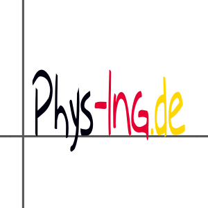

 # Logo Generation with LaTeX and Inkscape

## LaTeX

There are two [LaTeX](https://en.wikipedia.org/wiki/LaTeX) files:

* *phys-ing.de-logo.tex* for actual logo
* *phys-ing.de-favicon.tex* for the [favicon](https://en.wikipedia.org/wiki/Favicon) (short for favorite icon)

 A small shell script (*make.sh*) calls `latex` to generate the dvi files. Then it calls `dvisvgm` to create
 a svg picture from LaTeX's output. Finally, the script uses `inkscape` to genreate png files in various sizes.

 Another small shell script (*clean.sh*) deletes the generated output files.

The logo looks like this (100x300px):

![logo 100x300px][logo]

And this is the favicon (32x32px):  ![favicon 32x32px][favicon]

The logo in square format (300x300px): 

On GitHub we us the *phys-ing.de-logo-300x300px.png* as logo.

[logo]: ./phys-ing.de-logo-100x300px.png
[favicon]: ./phys-ing.de-favicon-32x32px.png

